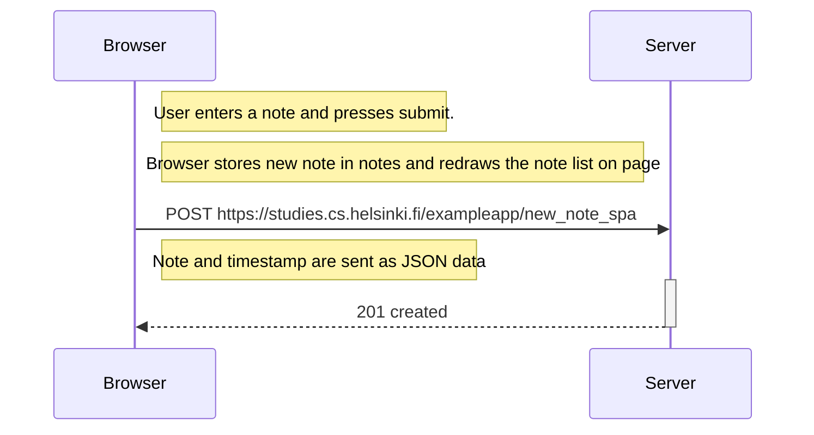

# 0.6: New note in single page app diagram

```mermaid 
sequenceDiagram
    participant Browser
    participant Server

    Note right of Browser: User enters a note and presses submit.

    Note right of Browser: Browser stores new note in notes and redraws the note list on page

    Browser->>Server: POST https://studies.cs.helsinki.fi/exampleapp/new_note_spa
    Note right of Browser: Note and timestamp are sent as JSON data
    activate Server
    Server-->>Browser: 201 created 
    deactivate Server
    
```